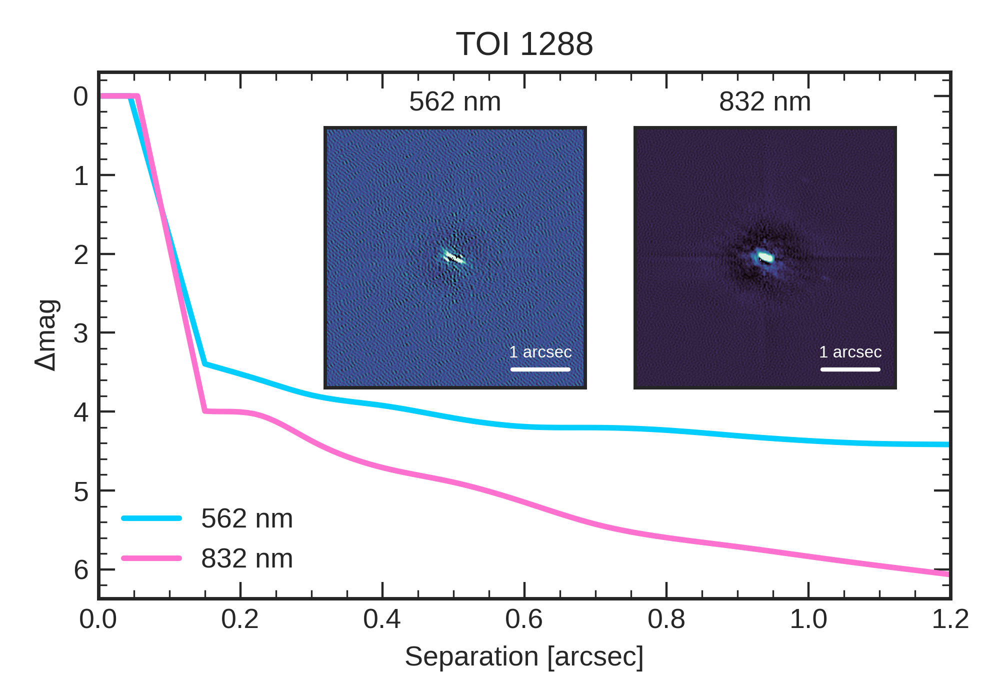

# Speckle

A Python plotting script for astronomical speckle imaging data analysis and visualization.

## Overview

Speckle visualizes speckle interferometry data from astronomical observations. It supports multiple instruments: NESSI, DSSI, Alopeke, and Zorro.

## Installation

```bash
pip install git+https://github.com/john-livingston/speckle
```

## Usage

```bash
speckle-plot -i TIC365733349 -n "TOI 1288"
```

### Command Line Options

- `-i, --id`: Target identifier (e.g., TIC ID)
- `-n, --name`: Target name for plot titles
- `-d, --data-dir`: Directory containing speckle data files
- `--inst`: Instrument type (NESSI, DSSI, Alopeke, Zorro)

### Example Output



## Supported Instruments

| Instrument | Blue Channel | Red Channel | Blue λ (nm) | Red λ (nm) |
|------------|--------------|-------------|-------------|------------|
| NESSI      | b           | r           | 562         | 832        |
| DSSI       | a           | b           | 692         | 880        |
| Alopeke    | 562         | 832         | 562         | 832        |
| Zorro      | 562         | 832         | 562         | 832        |
